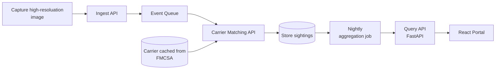
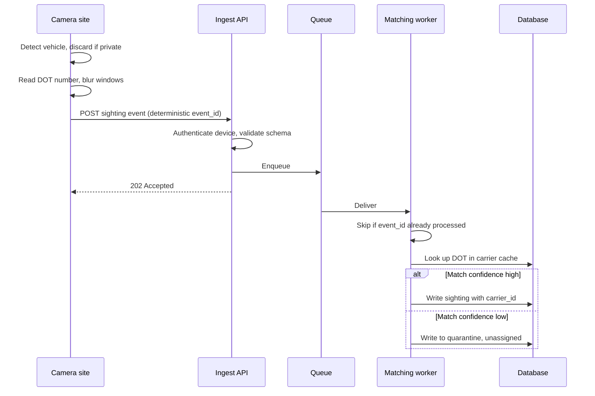
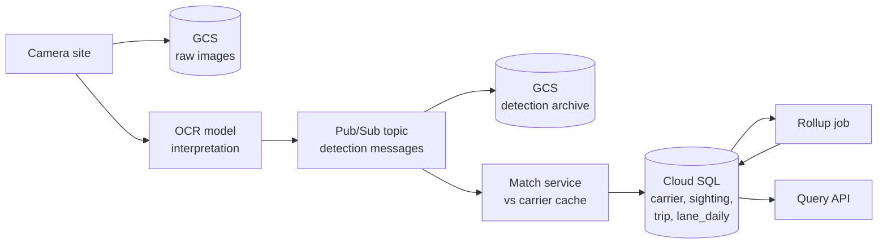
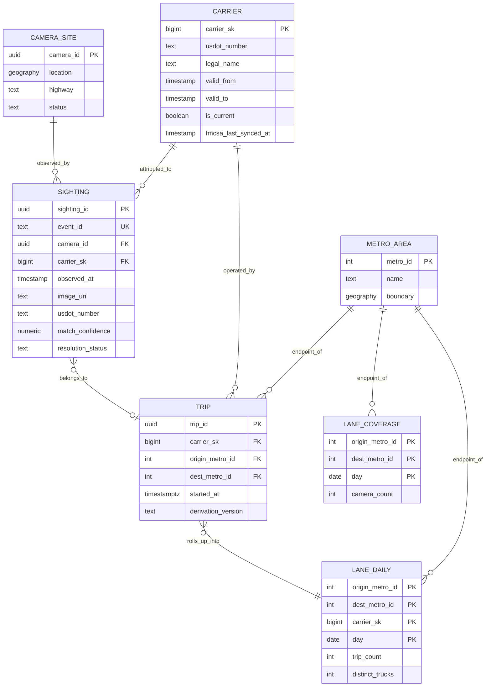

# GenLogs Take-Home Solution

## System Architecture



### Design decisions

A message queue is placed between the Ingestion API and the Carrier Matching
API to decouple image ingestion from the carrier matching process. This
ensures that image capture succeeds even if the matching service experiences
latency.

Furthermore, FMCSA data is cached rather than fetched synchronously; making
synchronous calls for every image would create an unacceptable dependency on
the external FMCSA government website.

Finally, to efficiently answer queries about carrier traffic volumes between
locations, we avoid scanning billions of rows on demand. Instead, we process
data via a scheduled aggregation job and store precomputed records, ensuring
data retrieval remains performant and accessible.

### Ingesting a sighting — sequence diagram



### Database design

This data modeling process reflects three distinct concerns:

- **Observation** — Raw, high-resolution images captured from the field.
- **Interpretation** — The model's analysis and classification of those raw images.
- **Derivation** — Pre-computed data metrics, such as trip counts, used for efficient querying.



#### Interpretation JSON message

```json
{
  "schema_version": "1.0",
  "event_id": "c1f4a9e2b7d3...",
  "camera_id": "8f3b21c4-...",
  "observed_at": "2026-08-04T14:23:11.482Z",
  "location": { "lat": 38.2527, "lon": -85.7585 },
  "image_uri": "gs://genlogs-raw-images/camera_id=8f3b21c4-.../dt=2026-08-04/hour=14/c1f4a9e2b7d3.jpg",
  "edge_model_version": "ocr-2026.07.3",
  "privacy_filter_version": "pf-2026.05.1",
  "detections": {
    "usdot": [
      { "normalized": "1234567", "confidence": 0.962 },
      { "normalized": "1234567", "confidence": 0.741 }
    ],
    "license_plate": [
      { "normalized": "8823TR", "state": "KY", "confidence": 0.884 }
    ],
    "truck_id": [
      { "normalized": "4471", "confidence": 0.795 }
    ],
    "company_logo": [
      { "label": "acme_freight", "confidence": 0.913 }
    ],
    "equipment": [
      { "label": "dry_van", "confidence": 0.958 }
    ]
  }
}
```

#### Cloud SQL data model



## Delivery

### Application Url

Url: https://genlogs-portal-ggn2jodiha-uc.a.run.app

## Prompts and Rules used

I started by designing the system architecture with the following prompt:

> "Act as an experienced software architect, data modeler, and cloud
> engineer. I want to store raw observation images in blob storage (for
> example, Google Cloud Storage). The interpretation layer should consist of
> an OCR model that returns a structured JSON response. That JSON payload
> should be published to a message queue and include any detected license
> plate characters, truck identification numbers, company logos, and USDOT
> numbers. After a matching API identifies the carrier using a cached carrier
> dataset, persist the results in a relational database. My initial
> assumption is that the relational model only requires the tables Carrier,
> Sighting, Trip, and a precomputed aggregate table Lane_Daily. Please
> validate or challenge that assumption and help refine the data model
> accordingly."

From that starting point, I used Claude as a conversational design partner
throughout the project to iteratively refine the implementation plan and
evaluate architectural trade-offs. Discussions covered topics such as
precomputed lane-level aggregations, FMCSA carrier caching strategies, and
data storage design. The tool helped me rapidly articulate ideas, create
diagrams, and stress-test assumptions.

Importantly, I did not accept its recommendations uncritically; I repeatedly
challenged, revised, and refined its suggestions, and in at least one case I
reversed my own earlier architectural decision after the separation of image
storage and structured data changed the trade-offs involved.

## Actual time spent on project

- **6 hours**: Project planning, system architecture design, and data model
  design to establish a scalable and maintainable foundation for the
  solution.
- **6 hours**: Learning, evaluating, and implementing the OpenSpec framework,
  including integrating it into the project workflow and validating core
  functionality.
- **2 hours**: Containerizing the backend API and React portal, followed by
  deployment and configuration on Google Cloud Run.

**Total Hours: 14**
